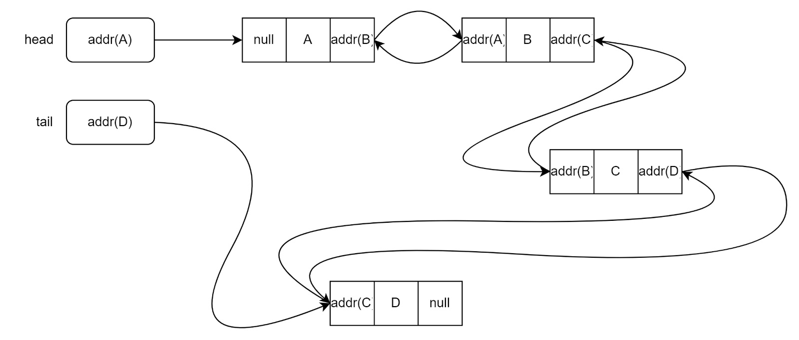
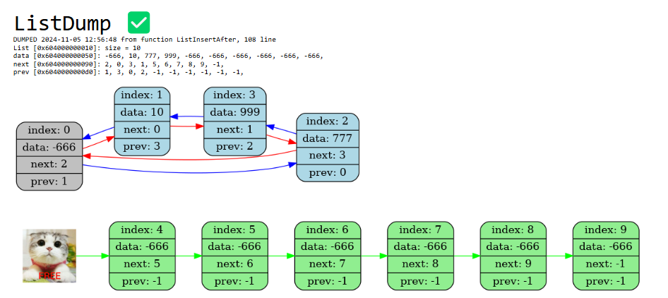

# **Double-linked-list**

**Double-linked-list** - data structure that consists of sequentially linked records called nodes. Each node contains three fields: two reference fields (pointers to the previous and next nodes in the node sequence) and one data field.



## Installation and compilation
To run the program on your computer, download the repository and run the Makefile
1. Cloning a repository
```bash
https://github.com/Yan103/Double-linked-list
```
2. Compilation of source files
```bash
make
```
3. Start
```bash
make run
```
4. Optional: remove files (deleting object and executable files)
```bash
make clean
```
For a more detailed study of the principle of operation of the program, you can also read the *documentation* that is available in.

## Principles of work
Using this data structure, you can insert and delete an item from the list in just a few assignments! A special graphical dump is also implemented (see photo below), which shows the status of the list. It is possible to realocate the list (increase the length if necessary).



## Contact information
If you are interested in this project or have any questions/suggestions about the project, you can contact the author:

**Mail**: fazleev.yans@phystech.edu

**Telegram**: @yan_ya_n3


